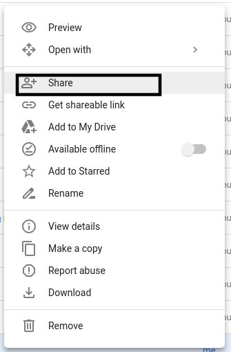
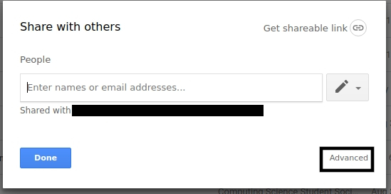
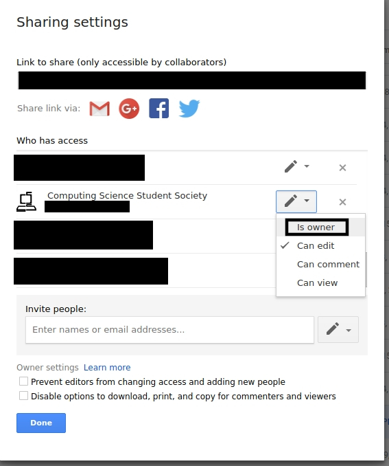

# managingCSSSResources

These are instructions on how to transfer the ownership of google documents back to the proper account on the SFU CSSS Google Drive after you create them.

>These only work with files that are created on the google drive and not files that were uploaded to google drive

