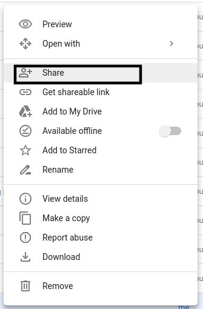
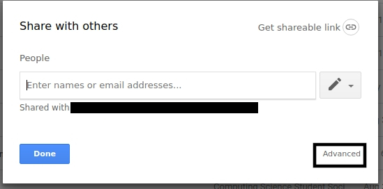
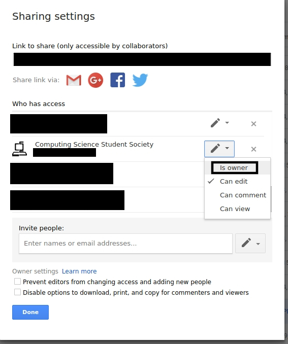

# managingCSSSResources

These are instructions on how to transfer the ownership of google documents back to the proper account on the SFU CSSS Google Drive after you create them.

>These only work with files that are created on the google drive and not files that were uploaded to google drive. With regards to folder, if any of its contents or subcontents are files that were uploaded, its ownership cannot be changed.

 1. Right Click on the file you created and then click "Share"  

 1. Click "Advanced"  

 1. Scroll to wherever the sfucsss account is and change its permission to "Is owner"  

